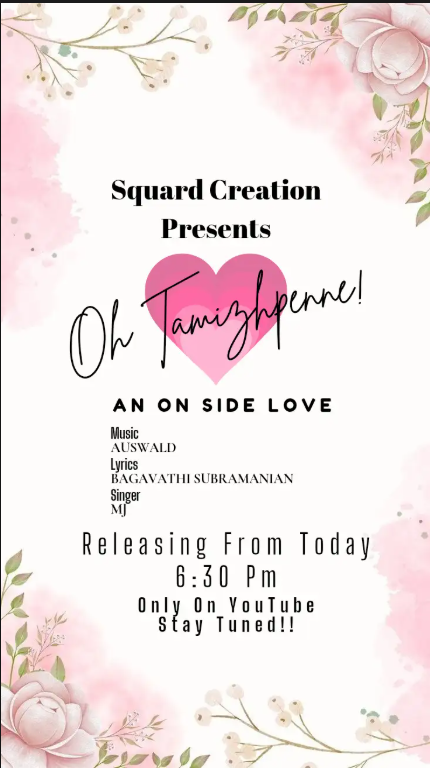

# Poster Design

A creative poster design project showcasing visual communication and graphic design skills.

## 📌 Project Overview

This repository contains a poster created using graphic design principles to effectively present information through visuals, typography, and layout.

## 📂 Project Files

- `poster.png` – Main poster design

## 🎯 Objectives

- Create an attractive and professional poster
- Apply design principles such as color, typography, and composition
- Improve visual communication skills
- Develop creative graphic design experience

## ✨ Features

- Modern and clean design
- High-quality graphics
- Professional layout structure
- Suitable for presentations, events, and promotional purposes

## 🛠️ Tools Used

- Adobe Photoshop / Canva / Graphic Design Software
- Image Editing Techniques
- Typography and Color Theory

## 📸 Poster Preview



## 🚀 How to Use

1. Clone the repository:
   ```bash
   git clone https://github.com/BagavathiSubramanian-227/poster.git
   ```

2. Open the poster image:
   ```text
   poster.png
   ```

3. View, edit, or use the design for learning purposes.

## 👨‍💻 Author

**Bagavathi Subramanian**

GitHub: https://github.com/BagavathiSubramanian-227

## 📄 License

This project is available for educational and portfolio purposes.
